browspy.js
=======

浏览器用户全部信息收集js
--------------------
这是一个通过html5,javascript用于收集用户通过上网泄漏的各种信息，包括地理位置，IP地址，照片，语音，浏览器版本等信息。结合大数据，可实现广告定向投放，用户追踪，用户行为分析，用户群体调研等一系列更人性化的服务。

###json保存个体的信息数据:
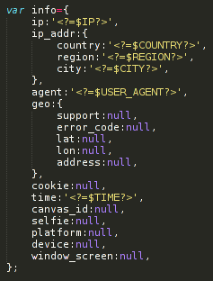

###内网外网IP地址
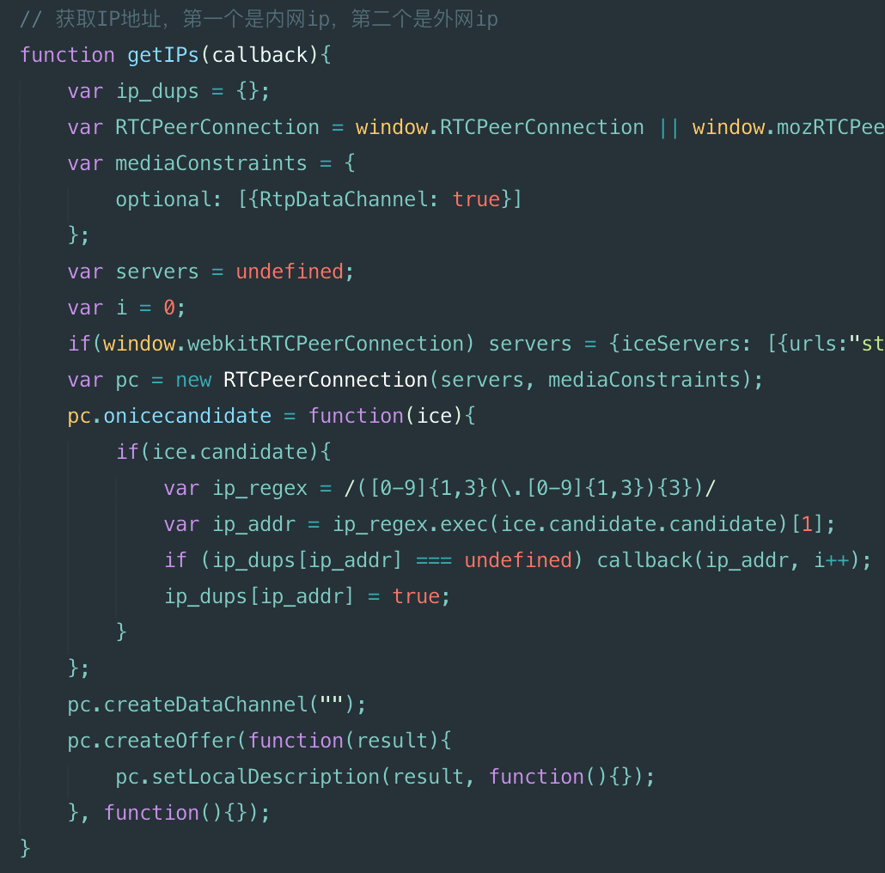

###内网扫描
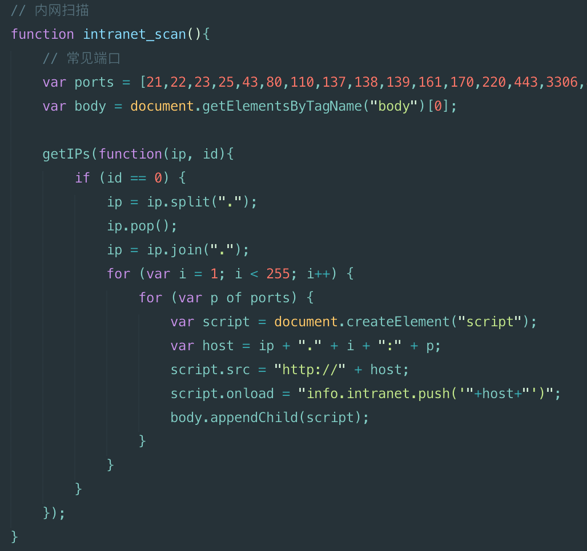

###地理位置信息
这个需要权限，用户允许才行！

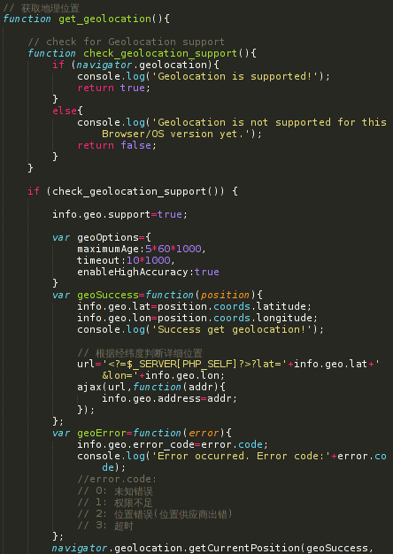

###canvas指纹
从根本上来说，每一种浏览器都会使用不同的图像处理引擎，不同的导出选项，不同的压缩等级，所以每一台电脑绘制出的图形都会有些许不同，这些图案可以被用来给用户设备分配特定编号（指纹），也就是说可以用来识别不同用户。

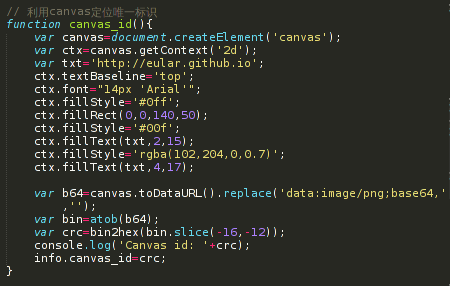

###获取用户头像
这个结合人脸识别还可以判断性别，年龄等敏感信息。

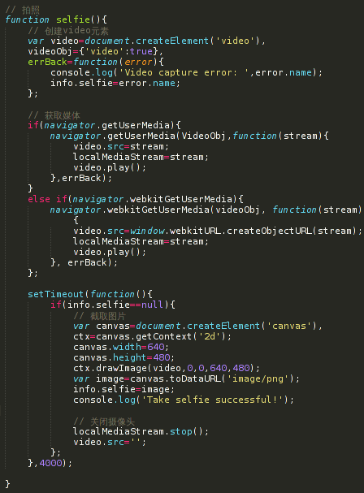

###精确定位
根据IP地址和经纬度。

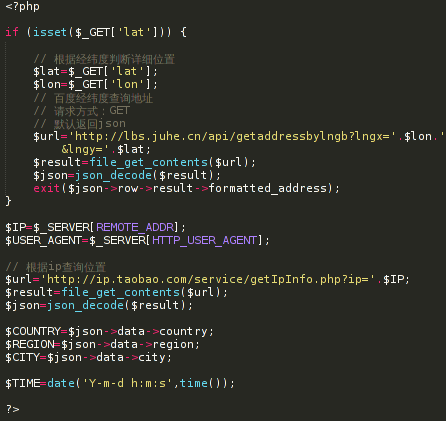

###DDos
需跨域

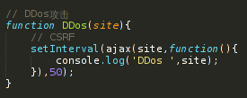

###操作系统,设备型号
当然要详细判断操作系统版本，这个相当粗糙有待完善。

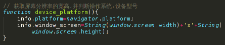

更新：新加详细的判断

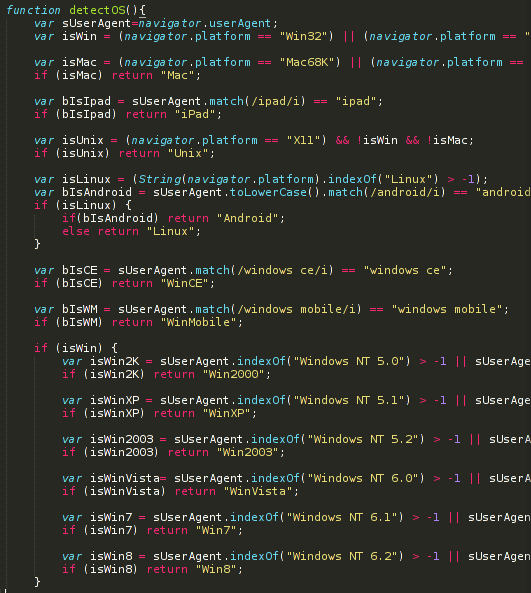

###录音
录音10秒钟，用blob保存为wav格式。

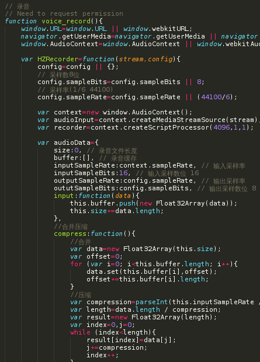

###网络测速
提供两种方式测速：图片测速和音频测速。

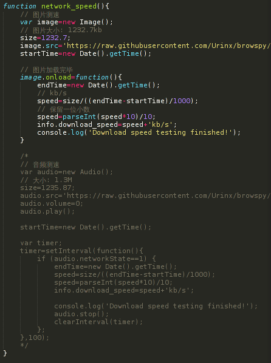

未完待续
------
1.更多